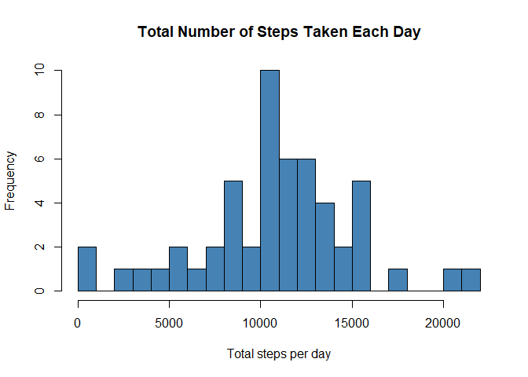
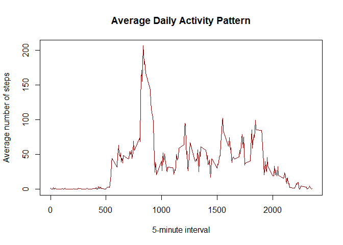
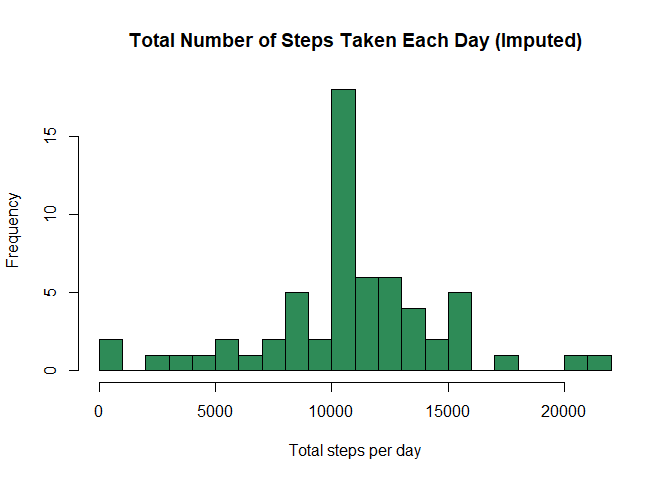
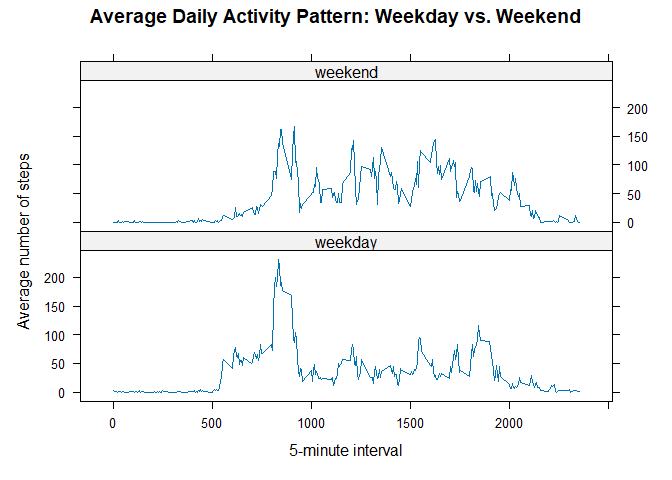

## Loading and preprocessing the data

The data for this assignment comes from a personal activity monitoring device.
It consists of two months of data from an anonymous individual collected
during the months of October and November, 2012, and includes the number of
steps taken in 5 minute intervals each day.


``` r
# Unzip the data file if it hasn't been unzipped yet
if (!file.exists("activity.csv")) {
    unzip("activity.zip")
}

activity <- read.csv("activity.csv", stringsAsFactors = FALSE)

# Convert the date column to Date class
activity$date <- as.Date(activity$date, format = "%Y-%m-%d")

str(activity)
```

```
## 'data.frame':	17568 obs. of  3 variables:
##  $ steps   : int  NA NA NA NA NA NA NA NA NA NA ...
##  $ date    : Date, format: "2012-10-01" "2012-10-01" ...
##  $ interval: int  0 5 10 15 20 25 30 35 40 45 ...
```

## What is mean total number of steps taken per day?

For this part of the assignment, missing values in the dataset are ignored.


``` r
steps_per_day <- aggregate(steps ~ date, data = activity, FUN = sum, na.rm = TRUE)

hist(steps_per_day$steps,
     main = "Total Number of Steps Taken Each Day",
     xlab = "Total steps per day",
     col = "steelblue",
     breaks = 20)
```

<!-- -->

Calculate and report the mean and median of the total number of steps taken
per day:


``` r
mean_steps   <- mean(steps_per_day$steps)
median_steps <- median(steps_per_day$steps)

mean_steps
```

```
## [1] 10766.19
```

``` r
median_steps
```

```
## [1] 10765
```

The mean total number of steps taken per day is 10,766.19,
and the median is 10,765.

## What is the average daily activity pattern?


``` r
interval_avg <- aggregate(steps ~ interval, data = activity, FUN = mean, na.rm = TRUE)

plot(interval_avg$interval, interval_avg$steps, type = "l",
     xlab = "5-minute interval",
     ylab = "Average number of steps",
     main = "Average Daily Activity Pattern",
     col = "darkred")
```

<!-- -->

Which 5-minute interval, on average across all the days in the dataset,
contains the maximum number of steps?


``` r
max_interval <- interval_avg[which.max(interval_avg$steps), ]
max_interval
```

```
##     interval    steps
## 104      835 206.1698
```

The 5-minute interval 835 contains, on average, the
maximum number of steps (206.17 steps).

## Imputing missing values

Note that there are a number of days/intervals where there are missing
values (coded as `NA`). The presence of missing days may introduce bias into
some calculations or summaries of the data.

Calculate and report the total number of missing values in the dataset
(i.e. the total number of rows with `NA`s):


``` r
total_na <- sum(is.na(activity$steps))
total_na
```

```
## [1] 2304
```

There are 2304 rows with missing `steps` values.

**Strategy for imputing missing values:** Missing values will be filled in
using the mean number of steps for that particular 5-minute interval,
computed across all days.


``` r
# Merge in the interval averages computed above
activity_imputed <- merge(activity, interval_avg, by = "interval",
                           suffixes = c("", ".avg"))

# Reorder to match original row order
activity_imputed <- activity_imputed[order(activity_imputed$date, activity_imputed$interval), ]

# Replace NA steps with the interval average
activity_imputed$steps[is.na(activity_imputed$steps)] <-
    activity_imputed$steps.avg[is.na(activity_imputed$steps)]

# Keep only the original columns
activity_imputed <- activity_imputed[, c("steps", "date", "interval")]
rownames(activity_imputed) <- NULL

# Confirm no NAs remain
sum(is.na(activity_imputed$steps))
```

```
## [1] 0
```

Make a histogram of the total number of steps taken each day using the
imputed dataset, and report the mean and median total number of steps taken
per day:


``` r
steps_per_day_imputed <- aggregate(steps ~ date, data = activity_imputed, FUN = sum)

hist(steps_per_day_imputed$steps,
     main = "Total Number of Steps Taken Each Day (Imputed)",
     xlab = "Total steps per day",
     col = "seagreen",
     breaks = 20)
```

<!-- -->

``` r
mean_steps_imputed   <- mean(steps_per_day_imputed$steps)
median_steps_imputed <- median(steps_per_day_imputed$steps)

mean_steps_imputed
```

```
## [1] 10766.19
```

``` r
median_steps_imputed
```

```
## [1] 10766.19
```

**Do these values differ from the estimates from the first part of the
assignment?**

- Mean (original, NAs ignored): 10,766.19
- Mean (imputed): 10,766.19
- Median (original, NAs ignored): 10,765
- Median (imputed): 10,766.19

Since missing values were imputed using the average for each interval, the
mean is essentially unchanged (entire missing *days* were replaced with a
"typical" day, which doesn't shift the overall average much). The median
shifts slightly and moves closer to the mean, because imputing with
interval averages adds more values near the center of the distribution.
**The main impact of imputing missing data is an increase in the total
daily step counts (taller bars in the middle of the histogram), since days
that previously contributed no data to `steps_per_day` (and were essentially
dropped) now contribute a full day's worth of imputed steps.**

## Are there differences in activity patterns between weekdays and weekends?

For this part, the imputed dataset is used, and a new factor variable is
created to indicate whether a date is a weekday or a weekend.


``` r
activity_imputed$day_type <- factor(
    ifelse(weekdays(activity_imputed$date) %in% c("Saturday", "Sunday"),
           "weekend", "weekday")
)

table(activity_imputed$day_type)
```

```
## 
## weekday weekend 
##   12960    4608
```

Make a panel plot containing a time series plot of the 5-minute interval
and the average number of steps taken, averaged across all weekday days or
weekend days:


``` r
interval_by_daytype <- aggregate(steps ~ interval + day_type,
                                  data = activity_imputed, FUN = mean)

library(lattice)

xyplot(steps ~ interval | day_type, data = interval_by_daytype,
       type = "l",
       layout = c(1, 2),
       xlab = "5-minute interval",
       ylab = "Average number of steps",
       main = "Average Daily Activity Pattern: Weekday vs. Weekend")
```

<!-- -->

Activity on weekday mornings shows a sharper, higher peak (likely a
morning commute), while weekend activity is more spread out across the
day with generally higher activity in the late morning and afternoon,
consistent with a more sedentary weekday work schedule and more varied
weekend activity.
